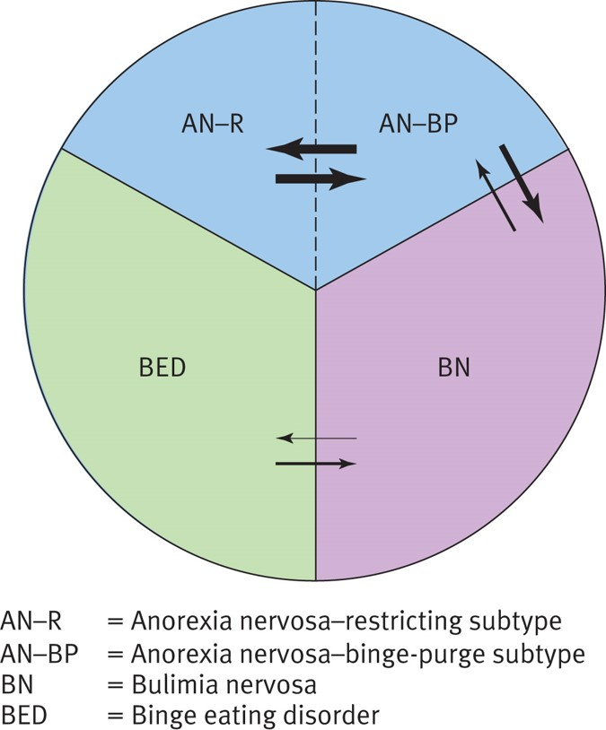

#Eating Disorders

__Clinical Aspects of Eating Disorders__

 - Characterized by persistent disturbance in eating behavior
 - The two most common forms of eating disorders are
	 - Anorexia nervosa
	 - Bulimia nervosa
 - Both disorders share
	 - An intense and pathological fear of becoming overweight and fat
	 - A pursuit of thinness that is relentless and sometimes deadly

__Age of Onset and Gender Differences__

- Anorexia nervosa is most likely to develop in 15- to 19-year-olds
- Bulimia nervosa is most likely to develop in women ages 20-24
- Eating Disorders in Males
	- Estimates, 3:1, female to male
	- Under-diagnosis due to:  
		- gender stereotypes
		- gender bias in DSM criteria (ex. Desire to be thin vs. Desire to be muscular)
	- Gay and bisexual men have higher rates than heterosexual men.

__Medical Complications of Eating Disorders__

- Anorexia can lead to
	- Death from heart arrhythmias
	- Kidney damage
	- Renal failure
	- Highest mortality rate of any Psychiatric disorder
- Bulimia can lead to
	- Electrolyte imbalances
	- Hypokalemia (low potassium)
	- Damage to hands, throat, and teeth from induced vomiting

__Eating Disorders and Suicide__

- After medical complications, suicide most common cause of death in AN.
- Range between 3-23 percent of pts will make a suicide attempt, rate of completed suicide 50 times greater than normal population.
- Loss of “emotionally protective” low body weight, high risk
- Older at onset of treatment/clinical attention higher risk
- BN not associated with increased risk of completed suicides, suicide attempts in 25-30 percent of cases

__Course and Outcome__

- AN: Studies vary in rates of recovery; however, several estimate approximately ½ of those diagnosed will eventually recover.
- BN: Studies also vary; however, rates are of recovery higher than AN
- BED: Like BN have high rates of clinical remission 

__The Long-Term Stability of Eating Disorders__

- “Diagnostic crossover” is quite common
- Pts with one form of a disorder may be later diagnosed with another eating disorder
- Cross-Over is more likely between specific subtypes
	- Bi-directional transitions between the two subtypes of anorexia nervosa (restricting and binge-purging)
- Uncommon between binge-eating disorder and anorexia or between bulimia into anorexia

__Comorbidity__

 - Eating disorders are associated with the following disorders:
 - Clinical Depression
	- 68% of AN; 63% of BN; 50% of BED
 - Obsessive Compulsive Disorder 
 - Substance-Abuse disorders
	- Particularly in Binge-purging, AN and BN; but not restricting AN 
 - Various Personality Disorders
	- Physiological Consequences (Irritability, Obsessional Thought) of ED may exacerbate pre-existing  personality disturbances.
	- Restrictive Type AN-Anxious/Avoidant Cluster of PD
	- Binge-Purge Syndromes-Cluster B, especially Borderline PD
	- More than 1/3 of patients with Eating Disorders have engaged in self-harming behavior-cutting, burning

__Causal Theories of Eating Disorders__

- Eating disorders are multi-determined
- Biological factors
	- Genetics
		- AN and BN show some heritability; however, research remains inconclusive
	- Set Point Theory
		- Weight that our bodies try to defend
	- Brain Abnormality-Hypothalamus
		- Hypothalamus has been associated with hunger and satiaty. 
		- We don't do brain surgery for this because we don't have enough evidence to support this theory
	- Altered Neurochemistry-Serotonin
		- Some pts respond well to treatment with SSRIs
		- Higher levels of metabolites of Serotonin in recovery interesting for future study
		- Serotonin impacts other neurotransmitter systems as well 
		- But are you just treating the comorbid depression? If so, can you get the person to a healthy mood level which causes healthier diet
- Sociocultural factors
	- Sociocultural influences often idealize extreme thinness
	- The thin ideal is often internalized
	- Western values toward thinness-fluidity
- Family influences
	- Families may be a source of cultural transmission of pathological values
	- A family member with an ED affects family functioning
	- Both mothers and fathers may contribute to the development of an Eating Disorder
	- Families of pts with ED are described as showing the following characteristics:
		- Limited tolerance of disharmonious affect or psychological tension
		- An emphasis on propriety and rule-mindedness
		- Parental over direction of the child or subtle discouragement of autonomous strivings
		- High parental expectations
		- Poor skills in conflict resolution
		- Preoccupations regarding the desirability of thinness, dieting, and good physical appearance
	- Always ask: What is the relationship with the parents and is there a familial history with regards to the eating disorder
		- What automatic thoughts are prevalent throughout your life
		- Negative suggestions from parents can cause a delay or rebellious individuation process in a teenager.
- Individual risk factors
	- Gender 
		- Female
		- For Males-sexual orientation
	- Age (adolescence for AN; older for BN)
	- Internalization of the thin ideal
	- Perfectionism
		- Enduring trait correlated with Eating Disorders
		- Men with ED less perfectionistic
	- Negative body image and Self-Perception
	- Dieting means of self-redemption
	- Negative emotionality (Feeling Bad, Self-Criticism)
	- Childhood sexual abuse (debatable)
	- A higher percentage of individuals come into weight loss surgery, in which they are given a psychological evaluation. They are assessing the overall reasoning for the surgery
- Cognitive Risk Factors
	- Obsessive Thoughts - What do you pay attention to? Are you hyperattentive to one aspect of your body. You ignore the rest.
	- Distortions of Attention and Memory
	- Obsessing about weight and shape, and using these characteristics to determine one’s self-worth are central to eating disorders
	- See the world through weight and shape schemata
	- All or Nothing, Black and White Thinking
- Combining Risk Factors - The combination of 
	1. The contextual background of sociocultural expectations to look and act a certain way
	2. Family interaction patterns that negate the individual’s attempts to achieve autonomy;
	3. Individual vulnerabilities based on genetics and personality, self-esteem, and identity deficit; and
	4. The stress required by transitional adjustments offers a potential starting point for identifying individuals most likely to develop an eating disorder.

__Treatment of Anorexia Nervosa__

- Challenging-Pessimistic outlook, high drop-out rate, lack of data on effective treatments
- Priority-Restore Weight
- Interventions:
	- Medication - SSRIs, Antipsychotics
	- Family Therapy - Adolescents with AN, tx of choice
	- CBT - Most effective in BN, perhaps due to cognitive rigidity in AN
- Family therapy is challenging to maintain. The tension that surfaces can be challenging
	- Parents may not want to hear about their role, so the therapy falls apart
- Antipsychotics - the idea is that the body distortion is literally a dillusion. There was an attempt for antipsychotic
- CBT doesn't actually work too well because the individual isn't as open to changing

__Treatment of Bulimia Nervosa__

- Medications - SSRIs more effective than AN
- CBT
	- Behavioral component-normalize eating pattern
	- Cognitive-cognitive distortions, dysfunctional thought patterns

____

####Notes:
- Compensatory Behaviors - Compensatory behaviors are behaviors meant to compensate or "un-do" eating
- Similar to addictive disorders in the way it presents. Most people are within a spectrum from AN to BN
- Binge Eating disorder new to DSM-5
- Perfectionism is a core belief - treated through CBT
	- 1/3rd engage in self-harming behaviors such as cutting or burning
- Males may be trying to increase muscle definition to a pathological level
- Dentists are some of the first to notice due to the removal of enamal
- You wouldn't expect someone with a restricting type of anorexia to crossover into bulimia

####Emotionally Protective Low Body Weight
Suicide risk is high as patients start (medically but not yet psychologically) to recover--i.e., to gain weight--because their self-evaluation (happiness, self-worth) is tied to their weight. 

####Set Point Theory
A hypothesis that the brain has an internal control mechanism that adjusts metabolism to maintain a certain genetically/biologically predetermined “set point” level of body fat. 

####Cognitive rigidity in Anorexia Nervosa 
- Starvation is associated with many psychological effects, including compromised ability to think flexibly = cognitive rigidity. 
- Harder for CBT to change distorted cognitions. 

####Symptoms: Fasting & Exercise 
These symptoms most often associated with the B-E/P Type, but can be a symptom of both types. Main difference is that in B-E/P Type, fasting and exercise are compensatory for binging. 

####Pica
- Persistently eating nonnutritive substances (e.g., paper, clay, soil, sand, chalk) for at least 1 month
	- Developmentally inappropriate and not culturally sanctioned/normative 
- If occurring with another mental disorder (e.g., autism), must be severe enough to warrant independent clinical attention

####Rumination Disorder
- Repeated regurgitation of food for at least 1 month
	- Not due to a medical condition (e.g., gastrointestinal)
- Does not only occur in course of AN, BN, BED, or Avoidant/Restrictive Food Intake
- If occurring with another mental disorder (e.g., autism), must be severe enough to warrant independent clinical attention 

####Avoidant/Restrictive Food Intake Disorder 
- Eating or feeding disturbance leading to persistent failure to meet appropriate nutritional and/or energy needs, associated with one or more of the following: 
	1. Significant loss of weight (or failure to gain weight/grow in children) 
	2. Significant nutritional deficiency
	3. Dependence on nutritional supplements 
	4. Interference with psychosocial functioning
- Not because of lack of available food/cultural practices 
- Does not occur exclusively during AN or BN, no evidence of cognitive disturbance with way weight/shape is experienced 
- Not better explained by other mental disorder/medical
condition

####AN-Binging/Purging Type vs. BN
- Patients with BN tend to be of normal or higher than normal body weight vs. AN weight is less than ~85% of that expected
- Anorexia trumps Bulimia*--if the patient meets all criteria for both AN and BN, only diagnose AN Binge-Eating/Purging Type
* DSM-5 Bulimia criteria: “The disturbance does not occur exclusively during episodes of anorexia nervosa.”

####Non-Purging Bulimia vs. Restricting Anorexia 
- BN, Non-Purging Type: normal or higher than normal weight, binge eat, compensate for binge eating through dietary fasting or excessive exercising (instead of vomiting, laxatives, etc.) 
- AN, Restricting Type: significantly low body weight, don’t binge eat, may fast or exercise but not to compensate for binge eating 

####Figures:

