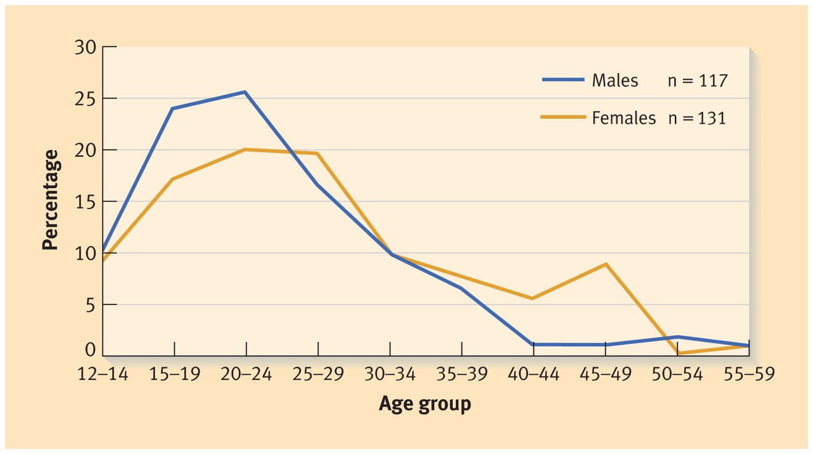
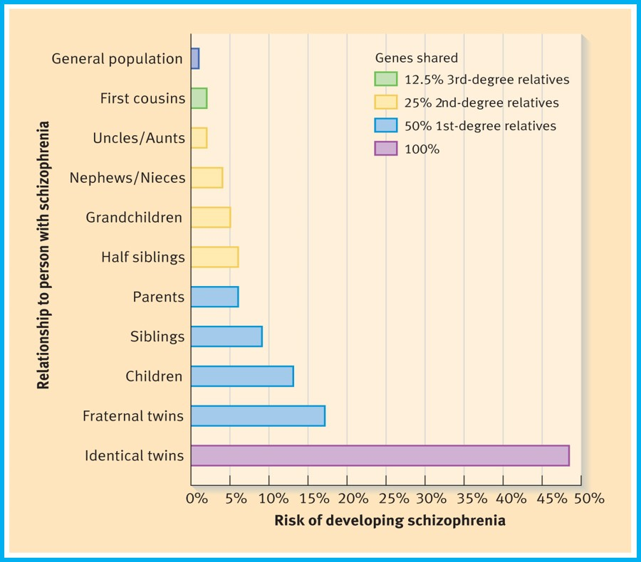
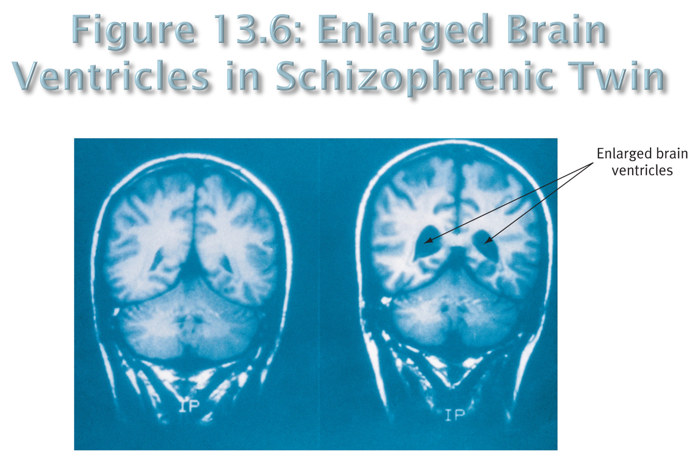
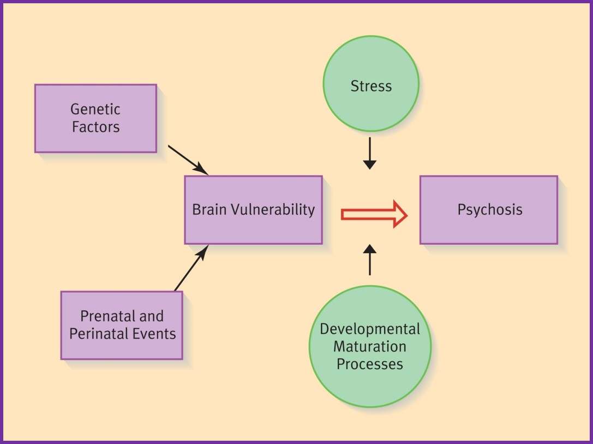

#Schizophrenia  Spectrum and Other Psychotic Disorders

__DSM-5__

- Schizophrenia Spectrum and Other Psychotic Disorders
	- Schizophrenia
	- Other Psychotic Disorders
	- Schizotypal (Personality) Disorder

__Schizophrenia__

- The hallmark of schizophrenia is psychosis — a significant loss of contact with reality
- “Split Mind” does not refer to multiple personalities.  
	- Bleuler (1911) believed there was a split from reality - believed it was derived from a disorganization of thought processes
	- There is a split within the intellect, between the intellect and emotion, and between the intellect and external reality.

__Clinical Picture__

- Hallmark symptoms include:	
- Delusions
	- An erroneous belief that is fixed and firmly held despite clear contradictory evidence
	- Disturbance in the content of thought
	- Examples include:
		- Made feelings or impulses - One’s thoughts, feelings or actions are controlled by external agents
		- Thought broadcasting - Private thoughts are broadcast to others
		- Thought insertion or withdrawal - Thoughts are inserted or withdrawn by an external force
		- Delusions of reference - A neutral environmental event is believed to have special and personal meaning
- Hallucinations
	- A sensory experience that seems real but occurs in the absence of any external perceptual stimulus
	- May have personal meaning 
	- Can occur in any sensory modality - Auditory is most common
	- PET and fMRI studies suggest that auditory hallucinations may be misperceived subvocal speech
- Disorganized speech
	- Failure to make sense despite conforming to semantic and syntactic rules of speech
	- “Cognitive slippage,” “loosening” of associations, or “incoherence”
	- Words and word combinations sound communicative, but listener is left with no understanding.
- Disorganized and catatonic behavior
	- Impairment of goal-directed activity
	- Occurs in areas of daily functioning
		- Work 
		- Social relations
		- Self-care (hygiene, safety, dress)
	- Catatonia involves almost no movement at all, sometimes in an unusual posture

__Positive and Negative Symptoms__

- Positive symptoms of schizophrenia reflect an excess or distortion in a normal repertoire of behavior and experience such as:
	- Delusions
	- Hallucinations 
	- Disorganized speech
	- Disorganized behavior
- Negative symptoms reflect an absence or deficit of behaviors that are normally present
	- Flat or blunted emotional expressiveness
	- Alogia-Very little speech
	- Avolition-Inability to initiate or persist in goal directed activities

__Subtypes of Schizophrenia (DSM IV-TR)__

- Subtypes of Schizophrenia in DSM-IVTR included the following.  Subtypes are no longer included in DSM-5
	- Paranoid type - Delusions or auditory hallucinations are present, but thought disorder, disorganized behavior, or affective flattening are not
	- Disorganized type - Where thought disorder and flat affect are present together
	- Catatonic type - The subject may be almost immobile or exhibit agitated, purposeless movement. Symptoms can include catatonic stupor and waxy flexibility
	- Undifferentiated type - Psychotic symptoms are present but the criteria for paranoid, disorganized, or catatonic types have not been met
	- Residual type - Where positive symptoms are present at a low intensity only

__Other Psychotic Disorders__

- Other psychotic disorders include:
- Schizoaffective disorder
	- Hybrid of schizophrenia and mood disorder
	- Mood Symptoms have met full criteria and present for 50% of the illness
	- Its difficult to diagnose. Less scary than Schizophrenia
	- There has to be a period of pure psychosis for at least two weeks. That is extremely difficult to determine when you are psychotic and emotionally imbalanced a lot of the time
- Schizophreniform disorder - Like schizophrenia but only 1-6 months long
- Delusional disorder - Delusions but otherwise normal behavior
	- Seems perfectly normal but suffering from extreme delusions, usually of grandiosity
	- Typically lasts a month
- Brief psychotic disorder - Usually lasts only a matter of days. Onset usually due to loss or extreme emotional experiences

__Risk and Causal Factors__

- Genetic factors are clearly implicated in schizophrenia
	- The influence of genetics is revealed by
	- Twin studies - Higher concordance rate for MZ than DZ twins
	- Adoption studies - Schizophrenia more common in biological than adoptive families of adoptees
	- Studies of molecular genetics - Unlikely that schizophrenia is linked to only one gene
- Prenatal and Perinatal Factors
	- Other factors that have been implicated in the development of schizophrenia include:
	- Prenatal infection
	- Rhesus incompatibility
	- Early nutritional deficiencies
	- Perinatal birth complications
- Genes and Environment in Schizophrenia: A Synthesis
	- Current thinking emphasizes the interplay between multiple genetic and environmental factors
	- Schizophrenia is genetically influenced but not genetically determined
- Having a relative with the disorder significantly raises a person’s risk of developing schizophrenia
- A Neurodevelopmental Perspective
	- A lesion in the brain is thought to lie dormant until normal developmental changes occur 
	- These changes expose the problems that result from this brain abnormality
	- May involve abnormalities in the process of cell migration which occurs during the second trimester
	- Developmental precursors may include motor abnormalities, low positive facial emotion, and high negative facial emotion
	- Cell Migration, the proliferation of neurons, may contribute to the development of schizophrenia. Some problems with migration may result in a compromised brain state.

__Other Biological Factors__

- Many brain areas are abnormal in schizophrenia including:
	- Decreased brain volume
	- Enlarged ventricles
	- Frontal lobe dysfunction
	- Reduced volume of the thalamus
	- Abnormalities in temporal lobe areas such as the hippocampus and amygdala
- Abnormalities are not found in all patients
- Neurotransmitters implicated in schizophrenia include:
	- Dopamine
		- The Dopamine Hypothesis and Evidence such as:
		- Pharmacological Success of Chlorpromazine
		- Amphetamine Induced Psychosis
		- L-Dopa - precursor to dopamine
		- Dopamine and Salience
		- Increased density of D2 receptors, Dopamine Supersensitivity
	- Glutamate Hypothesis
		- Dysregulation in glutamate systems
		- Dopamine inhibits glutamate

__Psychosocial and Cultural Factors__

- Many theories about bad families causing schizophrenia have not stood the test of time including:
	- The idea of the “schizophrenogenic mother” - whose cold and aloof behavior was the root cause of schizophrenia, was very influential in many clinical circles
	- The double-bind hypothesis
- Instead, communication problems may be the result of having a schizophrenic in the family 
- Expressed Emotion and Relapse
	- EE-how a family member speaks about the patient during a private interview with a researcher
	- Criticism, Hostility and Emotional Over-involvement

__Psychosocial and Cultural Aspects__

- Urban Living - No conclusive evidence as to whether its the environment that caused it or the people with the disposition are more likely to live in this environment.
- Immigration - Predisposition to the disorder as well as the stress of a new environment
- Cannabis Abuse - Genetic correlation has been found for people who have a disposition to schizophrenia and cannabis abuse

__Treatments and Outcomes__

- Before the 1950s, the prognosis for schizophrenia was bleak
- Antipsychotic drugs, introduced in the 1950s, dramatically improved the prognosis
- Currently, about 38% of people diagnosed with schizophrenia function well 15-25 years later
- Long-term institutionalization is necessary for about 12%
- Life expectancy shortened
- Suicide risk higher

__Pharmacological Approaches__

- First-Generation Antipsychotics
	- Neuroleptics, chlorpromazine (Thorazine); haloperidol (Haldol)
	- Dopamine Antagonists - increase the chemical effectiveness of dopamine
	- Positive Symptoms
	- Extrapyramidal Side Effects-involuntary movements
	- Tardive Dyskinesia - a difficult-to-treat and often incurable disorder resulting in involuntary, repetitive body movements.
	- Neuroleptic Malignant Syndrome-high fever, muscle rigidity, fatal untreated
	- Not a great treatment for treating lack of affect or lack of motor ability, and as a result can lead to more involuntary movements
- Second-Generation Antipsychotics
	- Examples: clozapine (Clozaril); risperidone (Risperdal), olanzapine (Zyprexa),
	- Fewer extrapyramidal (motor abnormality) side effects
	- No support for belief that these are more effective
	- Side effects-drowsiness, weight gain, diabetes - stems from a thyroid issue

__Psychosocial Approaches__

- Psychosocial approaches include:
- Family therapy 
	- working with patients and their families to educate them about schizophrenia, 
	- to help them improve their coping and problemsolving skills, 
	- and to enhance communication skills, especially the clarity of family communication.
- Case management - acts as a broker, referring the patient to the people who will provide the needed service
- Social-skills training
	- designed to help patients acquire the skills they need to function better on a day-to-day basis.
	- These skills include employment skills, relationship skills, selfcare skills, and skills in managing medications or symptoms.
- Cognitive remediation - 
	- researchers are trying to help patients improve some of their neurocognitive deficits (e.g., problems with verbal memory, vigilance, and performance on card-sorting tasks).
	- The hope is that these improvements will translate into better overall functioning.
- Cognitive-behavioral therapy
	- Current data suggest that CBT is not very helpful for negative symptoms
	- The goal of these treatments is to decrease the intensity of positive symptoms, reduce relapse, and decrease social disability.
- Individual treatment
	- a nonpsychodynamic approach that equips patients with a broad range of coping techniques and skills. 
	- The therapy is staged, which means that it comprises different components that are administered at different points in the patient’s recovery
	- Educating patients about the illness and its treatment is also helpful and also prevents relapse

####Notes
- Alogia and Avolition are important
- Cocaine or amphetamine induced psychosis can present the same as an individual with psychosis
- Who are the voices? Are these messages from your parents or that you believe to maybe be symbolic
- Note: when someone is stablized on medication, these can be some of the most gentle patients you will ever treat. No exaggeration or emotional extremes. We have some inidividuals that we say are internall preoccupied
- Its still possible that someone could present with a "classic" particular subtype
- Can we view hallucination as a cognitive distortion, many newer treatments have attempted to apply CBT to psychosis

####Schizoaffective vs. Schizophreniform
- Schizoaffective Disorder: requires mood disorder symptoms meeting full criteria
	- Bipolar type (includes manic or mixed episodes)
	- Depressive type (major depressive episodes only) 
- Schizophreniform Disorder: looks like Schizophrenia, but only 1-6 months long
	- no mood disorder symptoms or they do not reach clinical significance 

####Schizoaffective vs. Bipolar with Psychotic Features--a tough differential! 
- You will NOT need to make this distinction in a case analysis! Too difficult!
- “when psychotic symptoms occur during a mood episode of depression, mania, hypomania, or mixed episode” = MUST BE Major Depression with Psychotic Features or Bipolar Disorder with Psychotic Features 
- “Only when a psychotic condition lasts two weeks continuously or longer without mood symptoms is the diagnosis either schizophrenia or schizoaffective disorder.” 

####Schizophrenia 
- __What is the difference between first generation and second generation antipsychotic medications for treatment of schizophrenia?__
- First (typical) generation and second generation block dopamine (dopamine antagonists; occupying D2 dopamine receptors).
- Goal of second generation to have less movement-related side effects (extrapyramidal side effects; e.g., tremors) but some may not.
- First generation good at treating positive symptoms, second generation tried to be better at treating negative symptoms but not really work.
- Emphasis on what works for the patient rather than one being “better” than the other overall 

####Schizophrenia 
- Dopamine Hypothesis: Born from observations:
	- Thorazine was helpful to patients--linked to its ability to block dopamine receptors.
	- Amphetamines-->excess dopamine-->psychosis
	- Tx of Parkinson’s (low dopamine) with L-Dopa-->complications with psychotic symptoms 
- Why? Dopamine & Salience:
	- When dopamine is dysregulated, things that are not significant in normal brain are focused on more so-->small things around are huge, unable to censor things out
	- hum of refrigerator=voices talking 
- Glutamate hypothesis: Born from observations:
	- PCP blocks glutamate receptors-->psychotic symptoms similar to schizophrenia
	- Ketamine (used as an anesthetic) blocks glutamate receptors-->produced psychotic symptoms in healthy volunteers and exacerbated symptoms in schizophrenic patients.
		- Interestingly, Ketamine does not have this effect on children (neurodevelopmental perspective?)
	- May lead to new pharmacological treatments
	- The dopamine-glutamate relationship: Dopamine receptors inhibit the release of glutamate
	- an overactive dopaminergic system-->excessive suppression of glutamate

####Images
#####Figure 13.1: Age Distribution of Onset of Schizophrenia

- Just show that earlier onset for men in blue. Note that there is a dip around 45-49 and an increase for women
- One theory for this is that estrogen served as a protective factor

#####Figure 13.2: Risk of Developing Schizophrenia Based on Shared Genes

- Lifetime age-adjusted, averaged risks for the development of schizophrenia-related psychoses in classes of relatives differing in their degree of genetic relatedness.

#####Figure 13.6: Enlarged Brain Ventricles in Schizophrenic Twin

#####A Diathesis-Stress Model of Schizophrenia

- Genetic factors and acquired constitutional factors (such as prenatal events and birth complications) combine to result in brain vulnerability.
- Normal maturational processes, combined with stress factors (family stress, cannabis use, urban living, immigration, etc.), may push the vulnerable person across the threshold and into schizophrenia.